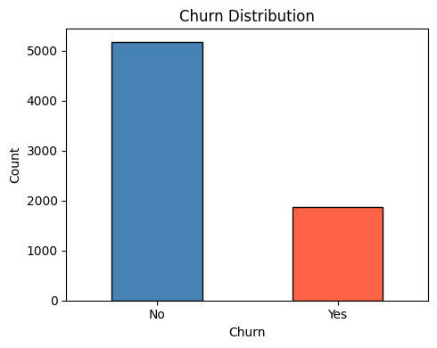
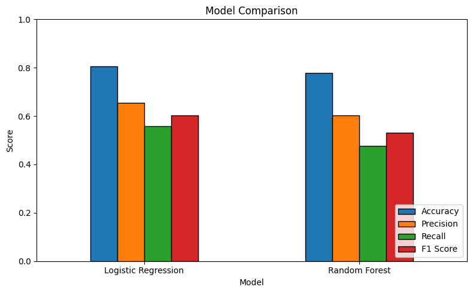
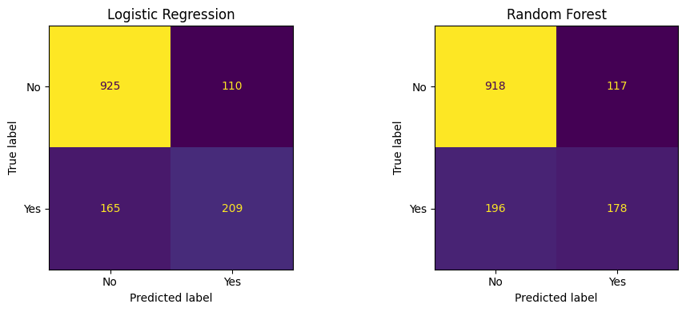
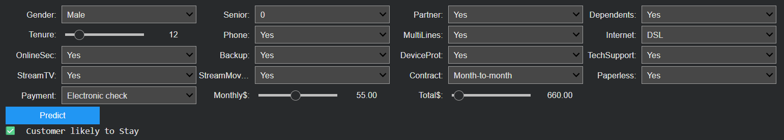

# Resume Screening System Using Machine Learning

A binary classification system that predicts candidate selection based on academic background, technical skills, and professional experience — trained on 50,000 candidate profiles.

---

## Project Overview

Automates the initial resume shortlisting process using supervised machine learning. The model evaluates structured candidate attributes and predicts whether a candidate should be selected or not.

---

## Features Used

| Category | Features |
|---|---|
| Academic | CGPA, Degree, Specialization, University Tier |
| Experience | Years of Experience, Internships, Projects, Certifications |
| Technical Skills | Python, SQL, Machine Learning, Deep Learning (scored 0–10) |
| Soft Skills | Communication, Leadership |
| Activity | GitHub Projects, Kaggle Score, Hackathons |
| Other | Age, Gender, Location, Expected Salary, Employment Gap |

**Target Variable:** `selected` (Yes / No)

---

## Technologies Used

- Python 3.x
- pandas, NumPy
- scikit-learn
- matplotlib, seaborn
- joblib
- ipywidgets (interactive demo in notebook)

---

## Workflow

```
Raw CSV (50,000 records)
  → Drop irrelevant columns (candidate_id)
  → Encode categorical features (OneHotEncoder)
  → Encode target variable (LabelEncoder)
  → Train/Test Split (80/20, stratified)
  → Train models
  → Evaluate & compare
  → Save best model as .pkl
  → Predict on new candidate input
```

---

## Models Used

| Model | Notes |
|---|---|
| Logistic Regression | Best model — selected based on accuracy (`liblinear` solver) |
| Random Forest | Compared as alternative classifier |

5-fold cross-validation used for model validation.

---

## Results Summary

| Model | Accuracy | Precision | Recall | F1 Score |
|---|---|---|---|---|
| Logistic Regression | 89.26% | 87.04% | 85.95% | 86.49% |
| Random Forest | 86.93% | 84.43% | 82.55% | 83.48% |

Logistic Regression achieved the highest accuracy and was selected as the best model for inference.

---

## Screenshots

### Class Distribution


### Model Comparison


### Confusion Matrix


### Prediction Output


## Installation

```bash
git clone https://github.com/sanskar811git/resume-screening-ml.git
cd resume-screening-ml
pip install -r requirements.txt
```

---

## Usage

**Run the notebook:**
```bash
jupyter notebook Resume_Screening_System_ML.ipynb
```

**Predict on a new candidate:**
```python
import joblib, pandas as pd

model = joblib.load("resume_screening_model.pkl")
preprocessor = joblib.load("preprocessor.pkl")
le = joblib.load("label_encoder.pkl")

candidate = {
    'age': 25, 'gender': 'Male', 'degree': 'B.Tech',
    'specialization': 'Computer Science', 'university_tier': 'Tier 1',
    'cgpa': 8.5, 'years_experience': 3, 'internships_count': 1,
    'projects_count': 3, 'certifications_count': 2,
    'python_skill': 8, 'sql_skill': 7, 'machine_learning_skill': 6,
    'deep_learning_skill': 5, 'communication_skill': 7,
    'leadership_skill': 6, 'github_projects': 4,
    'kaggle_activity_score': 7, 'hackathons_participated': 2,
    'expected_salary_lpa': 15, 'location': 'Bangalore',
    'employment_gap_months': 0
}

input_df = pd.DataFrame([candidate])
processed = preprocessor.transform(input_df)
result = le.inverse_transform(model.predict(processed))
print("Prediction:", result[0])
```

---

## Future Improvements

- Add resume text parsing (NLP-based feature extraction)
- Build a REST API using FastAPI or Flask
- Deploy on Streamlit Cloud or Hugging Face Spaces
- Handle class imbalance with SMOTE

---

## Author

**Sanskar Lokhande**  
[GitHub](https://github.com/sanskar811git) · LinkedIn *(coming soon)*
